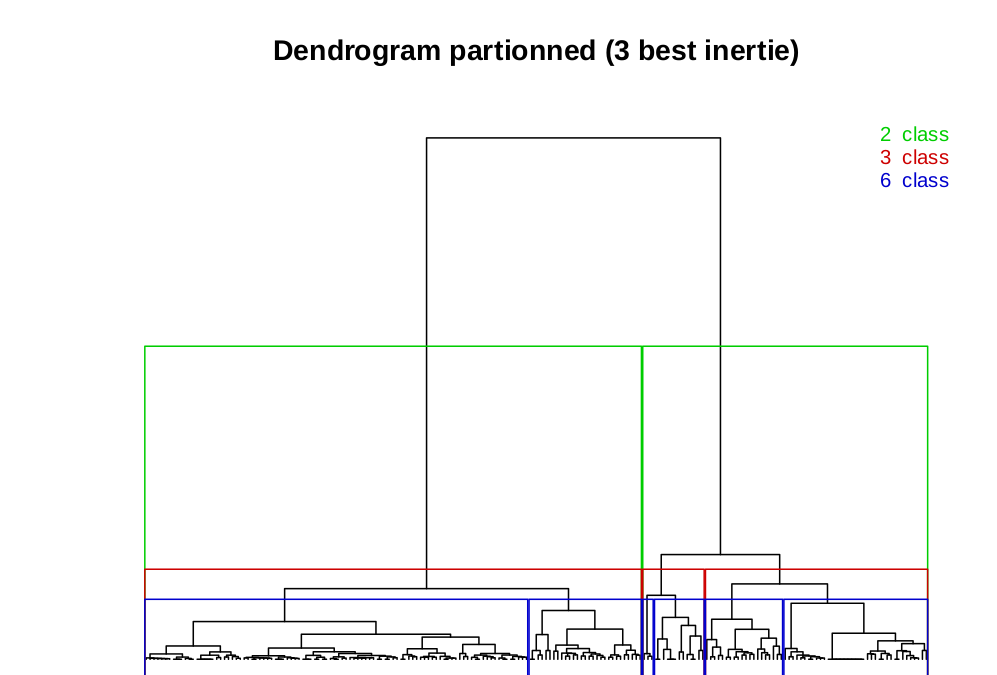
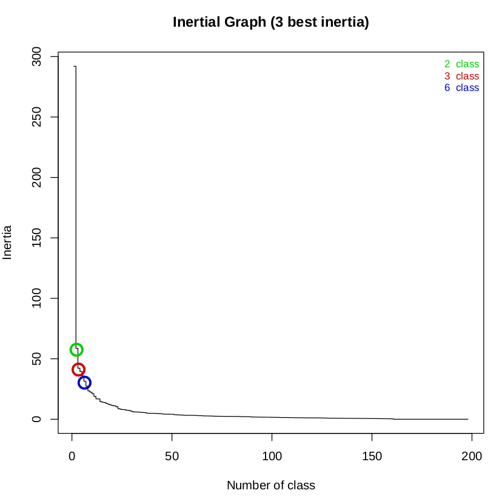

#CGST

A Core-Genome Sequence Typing tool

## Table of contents

* [Introduction](#introduction)
* [Requirements](#requirements)
* [Installation](#installation)
* [Method](#method)
* [Quick usage](#quick-usage)
* [Full usage](#full-usage)
* [Acknowledgments](#acknowledgments)
* [Citation](#citation)
* [License](#license)


## Introduction

CGST (Core-Genome Sequence Typing) has goal to use the species core-genome MLST (Multiple Locus Sequence Typing) and the WGS (Whole Genome Sequencing) information at a new level of genotyping.

CGST is a pipeline that have 2 main part: [Detection](#detection) and [Analysis](#analysis).

#### Detection

Detection part of CGST consist to detect the allele sequence for each locus of a bacterial strain describe in a cgMLST.

The allele detection is done with [MentaLiST](https://github.com/WGS-TB/MentaLiST) tool. The novels allelic sequences found are directly use to update the cgMLST database.

The [MentaLiST](https://github.com/WGS-TB/MentaLiST) output is enhanced by others information like classic MLST schema with [Ariba](https://github.com/sanger-pathogens/ariba) to produce the final CGST output.

CGST contains for each species cgMLST a list of combinations alleles and the combination found in the strain are stored in the `combination_result.tsv` file. 

The detection CGST part has a high memory consumption (MentaLiST consumption). More than 16Go with the `Escherichia coli` core-genome. 

#### Analysis

Analysis part of CGST consist to classify, summarize and compare the information provides by the detection part of CGST in a set of strains base on the same core-genome.

* The classification step consist to regroup the strains by their alleles difference on a numeric scale.

* The summarize step consist to get the alignment of the allele difference provide by [MAFFT](https://mafft.cbrc.jp/alignment/software/) then use [Gubbins](https://github.com/sanger-pathogens/gubbins) to remove the recombination SNP and get a SNP alignment. This alignment is use with [RaXML-ng](https://github.com/amkozlov/raxml-ng) to build the more accurate possible phylotree.  


## Requirements

CGST assumes that you have [MentaLiST](https://github.com/lh3/miniasm), [julia](https://julialang.org/downloads/)(for MentaliST), [Gubbins](https://github.com/sanger-pathogens/gubbins) - available by `run_gubbins` instead of `run_gubbins.py` , [RaXML-ng](https://github.com/amkozlov/raxml-ng), [MAFFT](https://mafft.cbrc.jp/alignment/software/) and [R](https://cran.r-project.org/) installed and available in your PATH. If you can run `mentalist -v`, `julia -v`, `run_gubbins --version`, `mafft`, `raxml-ng --version` and `R --version` on the command line, you should be good to go!

You'll need Python 3.6 or later to run CGST (check with `python3 --version`). The Python package requirement are [Biopython](https://biopython.org/wiki/Download) and [pandas](https://pypi.org/project/pandas/). If you don't already have this package, it will be installed as part of the CGST installation process.

You'll need R 3.6 or later to run CGST (check with `R --version`). The R package requirement are [optparse](https://cran.r-project.org/web/packages/optparse/index.html), [questionr](https://cran.r-project.org/web/packages/questionr/index.html), [cluster](https://cran.r-project.org/web/packages/cluster/index.html) and [fastcluster](https://cran.r-project.org/web/packages/fastcluster/index.html).

### Help for installation dependencies / Or use Singularity

You can follow the installation of the dependencies in the Singularity of CGST available on the repository.

Or you can build your own Singularity image by:

```bash
sudo singularity build CGST.simg Singularity
singularity exec CGST.simg cgst
```

## Installation

 Install from source

You can install CGST using [pip](https://pypi.org/project/pip/), either from a local copy:
```bash
git clone https://github.com/CNRResistanceAntibiotic/CGST.git
pip3 install ./CGST
cgst --help
```

or directly from GitHub:
```bash
pip3 install git+https://github.com/CNRResistanceAntibiotic/CGST.git
cgst --help
```

If these installation commands aren't working for you (e.g. an error message like `Command 'pip3' not found` or `command 'gcc' failed with exit status 1`) then check out the [installation issues page on the Badread wiki page](https://github.com/rrwick/Badread/wiki/Installation-issues) (a different tool done by [Ryan Wick](https://github.com/rrwick)).


### Run without installation

CGST can also be run directly from its repository by using the `CGST.py` script, no installation required:

```bash
git clone https://github.com/CNRResistanceAntibiotic/CGST.git
CGST/cgst/cgst.py -h
```

If you run CGST this way, it's up to you to make sure that [Biopython](https://biopython.org/wiki/Download) and [pandas](https://pypi.org/project/pandas/) are installed for your Python environment.


## Method

### Step 1: Display Core-Genome available

CGST mirror the [MentaLiST](https://github.com/lh3/miniasm) own download function that use the core-genome available in [cgmlst.org](https://www.cgmlst.org/ncs) and mirror the CNR [core_genomes](https://github.com/CNRResistanceAntibiotic/core_genomes) repo.

Command : `cgst available-species`


### Step 2: Download data to build the database

CGST download cgMLST in mirror of the [MentaLiST](https://github.com/lh3/miniasm) build function.

Example for "Escherichia coli"
Command : 
```
cgst build-database -db database_CGST_folder_path -sp "Escherichia coli" -t 12
```

### Step 3: Check CGST database

You can check the database of CGST.

Command : `cgst status-genome -db database_CGST_folder_path`


### Step 4: CGST detection

CGST detection command:

```
cgst detection -1 /illumina_reads/my_ecoli_S30_R1_001.fastq.gz -2 /illumina_reads/my_ecoli_R2_001.fastq.gz -db /database_CGST_path -w /detection_folder_output -o my_ecoli -sp "Escherichia coli" -t 12
```

The outputs are constitute by :

 - `ìntermediate_files` folder contains the [MentaLiST](https://github.com/lh3/miniasm) output files.
 - `my_ecoli_output_ariba` folder contains the ARIBA output files.
 - `combination_result.tsv` file contains the detection combination. 
 
 Column header          | Description                                                                                      
------------------------| ------------------------------------------------------------------------------------------------- 
 Combination Name       | Name of the locus combination                                        
 Count Reference Locus  | Sum of locus in the combination                           
 Count Sample Locus     | Sum of locus of the combination retrieves in the strain                           
 Ratio                  | Percent ration of the `Count Sample Locus` in the `Count Reference Locus`                                      
 Comment                | Commentary that appreciate the ratio with a scale
 
 Scale of Comment head columns :
 
    - Ratio == 100  -> `Perfect`
    - 100>Ratio>98  -> `Very Close`
    - 98>Ratio>90  -> `Close`
    - 90>Ratio>80  -> `Like`
    - 80>Ratio>70  -> `Close Like`
    - 70>Ratio>0  -> `No relevant`
 
 - `my_ecoli_output_final` file contains CGST final results.
 - `statistics.tsv` file contains the CGST statistics.
 
| Column header       | Description                                                                                      
|---------------------| ------------------------------------------------------------------------------------------------- 
| Total Locus         | Number of locus in the cgMLST              
| Perfect Locus       | Number of perfect locus match in MentaLiST                           
| Multiple Locus      | Number of multiple locus match (+) in MentaLiST                                      
| Low Coverage Locus  | Number of low coverage locus match (-) in MentaLiST
| None Locus          | Number of none locus match in MentaLiST
 
 

### Step 5: CGST analysis

Create a folder for analysis and copy the output final CGST files of the wanted strains.

The analysis can only done on 5 strains or more.

```
mkdir analysis_CGST
cp /detection_folder_output/detection_*/*_output_final analysis_CGST
```

CGST analysis command:

```
cgst analysis -dd /analysis_CGST -db /database_CGST_path -w /analysis_CGST/analysis_comput -sp "Escherichia coli"
```

The outputs are constitute by 3 folder and "all_report.tsv" file:

##### Folder : cluster

This folder contains:
 - The file `lvl_report.tsv` is the strain classification by an increase scale of alleles share by the strains.

##### Folder : combination

This folder contains:
 - The file `similarity_matrix.tsv` is the similarity matrix of the relevant locus of strains. 
 - The file `dendrogram_with_class.pdf` is the dendrogram that represent the 3 more relevant classification class of strains.
 
  <p align="center"></p>
 
 - The file `groups.tsv` is the classification class by strains for each of groups of the 3 class.
 - The file `inertial_graph.pdf` is the inertial class curve produce by the `hclust` R package.
 
 <p align="center"></p>
 
 - The file `logR.txt` is the log file of the R script `r_script.R`.
 - The file `groups_alleles.tsv` is classification of the strains, the alleles share by all strains and the alleles share more than 90% of the strains for each groups class and class.

##### Folder : phylotree

This folder contains:
 - The sub-folder `msa` contains files produces by [MAFFT](https://mafft.cbrc.jp/alignment/software/).
 - The file `core-genome.aln` is the core-genome alignment obtains by concatenation of the alignment [MAFFT](https://mafft.cbrc.jp/alignment/software/) files.
 - The file `resume_core-genome.tsv` is the resume of each locus position in the `core-genome.aln` file.
 - The sub-folder `gubbins` contains files produces by [Gubbins](https://github.com/sanger-pathogens/gubbins).
 - The sub-folder `raxml-ng` contains files produces by [RaXML-ng](https://github.com/amkozlov/raxml-ng).

The [RaXML-ng](https://github.com/amkozlov/raxml-ng) phylotree purpose is to be the more accurate phylogenetic tree between the strains based on the SNP.

##### File: all_report.tsv

This file contains all alleles detected for all strains of the analysis.

### Step 6: Add new combination

In the `combination` folder, the file `groups_alleles.tsv` contains the information to update/create the combination database for CGST detection.

In the species folder of the CGST-cgMLST database, update or create the file `combination_list.tsv`.
This file contains this columns:

| Column header      | Description                                                                                      
|--------------------| ------------------------------------------------------------------------------------------------- 
| Name               | The name of the combination              
| Number_Strain      | The number of strain regroups by this combination at the declaration of this combination                         
| Length_Combination | The number of alleles of the combination                                      
| Combination        | The sequence of the alleles of the combination

If the new combination that you have identified contains new alleles only on your local CGST database and you want to share your combination. Please go to the [issue](https://github.com/CNRResistanceAntibiotic/CGST/issues) page.

## Full usage

```
usage: CGST [commands][options] 

CGST: Core-Genome Sequence Typing - Version 0.0.1

positional arguments:
  <commands>                   Description
    check                      check Dependencies
    available-species          Available Species in cgmlst.org
    build-database             Build Database by species
    status-genome              Resume of genomes available
    detection                  Detection Sequence Typing
    analysis                   Analysis strains that had a cgMLST detection

optional arguments:
  -f [FORCE], --force [FORCE]  Overwrite output directory (default: False)
  -V, --version                Prints version number
  -h, --help                   Show this help message and exit
```

## Acknowledgments

This tool and this GitHub repository is mainly inspired by the work of [Ryan Wick](https://github.com/rrwick). A big thank to his work and the good practice in computer programming that he done.  

## Citation

In progress...

## License

[GNU General Public License, version 3](https://www.gnu.org/licenses/gpl-3.0.html)
